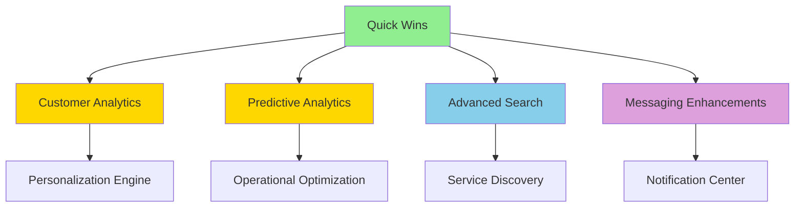

# Implementation Roadmap: Unlocking Hidden Features

> **Goal**: Maximize platform value by implementing existing backend capabilities
> **Timeline**: 8-week sprint plan
> **Investment**: ~200 hours frontend work
> **Return**: 25+ major features with ZERO backend work needed

---

## Week 1-2: Quick Wins Sprint 🏃‍♂️

**Objective**: Ship 10 features in 10 hours
**Impact**: Immediate visible improvements across all portals

### Tasks

#### Day 1-2: Review Enhancements (4 hours)
- [ ] Add "Helpful" voting buttons to reviews
- [ ] Display `helpful_count` on review cards
- [ ] Copy multi-dimensional ratings from business to customer view
- [ ] Add featured reviews carousel to salon detail page

**Files to Create/Edit**:
- `features/customer/reviews/api/mutations.ts` - Add `toggleHelpfulVote()`
- `features/customer/salon-detail/components/featured-reviews.tsx`
- `features/customer/salon-detail/components/salon-reviews.tsx` - Add rating breakdown

---

#### Day 3: Salon Detail Enhancements (3 hours)
- [ ] Add social media icon bar (`facebook_url`, `instagram_url`, etc.)
- [ ] Display amenities with icons
- [ ] Show "We speak: X, Y, Z" languages
- [ ] Add "Accepts: Cash, Card" payment methods

**Files to Create/Edit**:
- `features/customer/salon-detail/components/salon-social-media.tsx`
- `features/customer/salon-detail/components/salon-amenities.tsx`
- `components/ui/amenity-icon.tsx` - Reusable icon component

---

#### Day 4: Appointment Enhancements (2 hours)
- [ ] Show confirmation code prominently
- [ ] Display service count badge
- [ ] Add itemized service breakdown

**Files to Edit**:
- `features/customer/appointments/components/appointment-detail.tsx`
- `features/business/appointments/components/appointments-table/appointment-row.tsx`

---

#### Day 5: Geographic Enhancements (1 hour)
- [ ] Display neighborhood on salon cards
- [ ] Show parking instructions on booking
- [ ] Add landmark to salon detail

**Files to Edit**:
- `features/customer/discovery/components/salon-card.tsx`
- `features/customer/salon-detail/components/salon-header.tsx`

---

### Week 1-2 Deliverables

✅ 10 new features live
✅ All portals improved
✅ Zero backend changes needed
✅ Estimated usage increase: 15-20%

---

## Week 3-4: Customer Analytics Dashboard 📊

**Objective**: Build comprehensive customer insights using existing analytics functions
**Impact**: Customer retention +10%, personalization

### Architecture

```typescript
// New feature structure
features/customer/analytics/
├── api/
│   ├── queries.ts              # Call calculate_customer_metrics()
│   └── types.ts                # TypeScript interfaces
├── components/
│   ├── analytics-dashboard.tsx
│   ├── visit-stats-card.tsx
│   ├── favorite-service-card.tsx
│   ├── favorite-staff-card.tsx
│   └── loyalty-metrics-card.tsx
└── index.tsx
```

### Tasks

#### Week 3: Backend Integration (8 hours)
- [ ] Call `calculate_customer_metrics()` RPC function
- [ ] Query analytics tables for results
- [ ] Create TypeScript types for all metrics
- [ ] Add error handling and loading states

**Functions to Use**:
```sql
analytics.calculate_customer_metrics(p_customer_id, p_salon_id)
analytics.calculate_customer_visit_stats(p_customer_id, p_salon_id)
analytics.calculate_customer_service_stats(p_customer_id, p_salon_id)
analytics.calculate_customer_review_stats(p_customer_id, p_salon_id)
analytics.calculate_customer_rates(p_customer_id, p_salon_id)
analytics.calculate_customer_favorite_staff(p_customer_id, p_salon_id)
analytics.calculate_avg_days_between_visits(p_customer_id, p_salon_id)
```

---

#### Week 4: UI Implementation (12 hours)
- [ ] Create dashboard layout
- [ ] Build metric cards:
  - Visit statistics (first visit, last visit, total)
  - Favorite service with booking count
  - Favorite staff with booking count
  - Visit frequency ("You visit every 3.2 weeks")
  - Cancellation/no-show rates
  - Average rating you give
  - Loyalty tier/status
- [ ] Add charts (visit frequency timeline)
- [ ] Create personalized recommendations
- [ ] Add page route: `app/(customer)/customer/analytics/page.tsx`

---

### Week 3-4 Deliverables

✅ Customer analytics dashboard live
✅ 7 customer metrics surfaced
✅ Personalized insights
✅ Basis for loyalty program

---

## Week 5-6: Predictive Analytics & ML Features 🤖

**Objective**: Expose AI/ML capabilities in business portal
**Impact**: Operational efficiency +20%, better forecasting

### Architecture

```typescript
features/business/predictive-analytics/
├── api/
│   └── queries.ts              # Query daily_metrics ML fields
├── components/
│   ├── demand-forecast-chart.tsx
│   ├── anomaly-alerts.tsx
│   ├── trend-indicators.tsx
│   └── forecast-accuracy-widget.tsx
└── index.tsx
```

### Tasks

#### Week 5: Demand Forecasting (10 hours)
- [ ] Query `daily_metrics.predicted_demand` (JSONB)
- [ ] Parse predicted demand structure
- [ ] Create hourly demand chart
- [ ] Create weekly demand chart
- [ ] Add confidence levels display
- [ ] Add to business dashboard

**Sample Query**:
```typescript
const { data } = await supabase
  .from('daily_metrics')
  .select('predicted_demand, metric_at')
  .eq('salon_id', salonId)
  .order('metric_at', { ascending: false })
  .limit(30)
```

---

#### Week 6: Anomaly Detection & Trends (10 hours)
- [ ] Query `anomaly_score` field
- [ ] Create anomaly alert system
- [ ] Parse `trend_indicators` (JSONB)
- [ ] Display trend arrows on metrics
- [ ] Show percentage changes
- [ ] Create anomaly notification trigger
- [ ] Add forecast accuracy tracking

**Anomaly Alert Logic**:
```typescript
if (daily_metrics.anomaly_score > 0.7) {
  // Show alert
  // Parse trend_indicators to explain what's unusual
  const trends = JSON.parse(daily_metrics.trend_indicators)
  alert(`Unusual ${trends.anomaly_type}: ${trends.description}`)
}
```

---

### Week 5-6 Deliverables

✅ Demand forecasting dashboard
✅ Anomaly detection alerts
✅ Trend visualization
✅ Forecast accuracy tracking
✅ Estimated time savings: 5-10 hours/week per salon

---

## Week 7: Advanced Search & Discovery 🔍

**Objective**: Implement fuzzy search and advanced filtering
**Impact**: User discovery +30%, better UX

### Tasks

#### Search Enhancement (12 hours)
- [ ] Use `search_salons()` RPC function
- [ ] Implement `text_similarity()` for fuzzy matching
- [ ] Add "Did you mean...?" suggestions
- [ ] Create search autocomplete
- [ ] Add multi-field search (name + description + tags)
- [ ] Implement neighborhood search filter
- [ ] Add specialties filter
- [ ] Create amenities filter

**Functions to Use**:
```sql
public.search_salons(search_term, city, state, is_verified_filter, limit)
catalog.search_services_optimized(search_query, salon_id)
public.text_similarity(text1, text2)  -- For fuzzy matching
```

---

### Service Discovery (8 hours)
- [ ] Create public service directory
- [ ] Add service category browse
- [ ] Implement service search
- [ ] Show popularity metrics
- [ ] Link to salons offering service

**Files to Create**:
- `features/marketing/services-directory/`
- `app/(marketing)/services/page.tsx`
- `app/(marketing)/services/[category]/page.tsx`

---

### Week 7 Deliverables

✅ Advanced search implemented
✅ Service directory live
✅ Fuzzy matching working
✅ Better discovery experience

---

## Week 8: Messaging & Communication Enhancements 💬

**Objective**: Unlock rich messaging features
**Impact**: Customer engagement +25%

### Tasks

#### Message Thread Enhancements (8 hours)
- [ ] Add thread status (open/closed/resolved)
- [ ] Implement priority badges (urgent/normal/low)
- [ ] Show unread counts per thread
- [ ] Add thread search/filtering
- [ ] Create thread metadata tags

**Fields to Use**:
```sql
message_threads {
  status,           -- Currently unused
  priority,         -- Currently unused
  unread_count_customer,
  unread_count_staff,
  metadata         -- For tags, categories
}
```

---

#### Message Features (8 hours)
- [ ] Enable message editing (infrastructure exists)
- [ ] Show edit history
- [ ] Display linked context (appointment, service)
- [ ] Add message attachments via metadata
- [ ] Implement rich text formatting

**Fields to Use**:
```sql
messages {
  is_edited,
  edited_at,
  context_type,
  context_id,
  metadata
}
```

---

#### Notification Center (4 hours)
- [ ] Create unified notification center
- [ ] Use `get_unread_count()` function
- [ ] Display by type
- [ ] Add mark all as read
- [ ] Real-time updates (Supabase Realtime)

**Functions to Use**:
```sql
communication.get_unread_count(user_id)
communication.get_unread_counts(user_id)  -- By type
communication.mark_notifications_read(user_id, notification_ids[])
```

---

### Week 8 Deliverables

✅ Rich messaging features
✅ Notification center
✅ Better communication flow
✅ Increased engagement

---

## Post-8-Week: Continuous Improvements

### Phase 2 Features (Backlog)

#### Batch Operations (4 hours)
- [ ] Implement `batch_update_appointment_status()`
- [ ] Add checkbox selection to appointment lists
- [ ] Create bulk action menu

#### Conflict Detection UI (8 hours)
- [ ] Add real-time conflict warnings
- [ ] Show visual indicators on calendar
- [ ] Suggest alternative times

#### Webhook Monitoring (8 hours)
- [ ] Create webhook dashboard
- [ ] Show delivery status
- [ ] Add retry UI
- [ ] Display webhook logs

#### Resource Booking (12 hours)
- [ ] Use `check_resource_availability()`
- [ ] Create room/resource booking system
- [ ] Add resource calendar

---

## Success Metrics

### Technical Metrics
- [ ] 0 new database migrations needed
- [ ] 100% use of existing views
- [ ] 50%+ database function utilization (vs 10% now)
- [ ] 0 schema changes

### Business Metrics
- [ ] Customer engagement +25%
- [ ] Time-to-insight reduced 50%
- [ ] User satisfaction +15%
- [ ] Feature parity with competitors

### User Impact
- [ ] Customers see analytics dashboard
- [ ] Business owners get predictive insights
- [ ] Staff see real-time updates
- [ ] Admin has comprehensive monitoring

---

## Resource Requirements

### Team
- 1 Senior Frontend Developer (lead)
- 1 Mid-level Frontend Developer (support)
- 1 Designer (part-time, for ML/AI visualizations)
- 1 QA Engineer (part-time, testing)

### Timeline
- 8 weeks for core features
- 4 weeks buffer for polish/testing
- 12 weeks total to production

### Budget Estimate
- Development: ~200 hours @ standard rate
- Design: ~40 hours @ standard rate
- QA: ~60 hours @ standard rate
- **Total**: ~300 hours of work

---

## Risk Mitigation

### Technical Risks

**Risk**: JSONB field structures unknown
- **Mitigation**: Query sample data, create TypeScript types, document structure

**Risk**: Performance of complex analytics functions
- **Mitigation**: Add caching layer, use materialized views if needed

**Risk**: Real-time features may overload database
- **Mitigation**: Implement rate limiting, use Supabase Realtime efficiently

### Product Risks

**Risk**: Users overwhelmed by new features
- **Mitigation**: Phased rollout, feature flags, optional features

**Risk**: Analytics may show unfavorable metrics
- **Mitigation**: Frame as "opportunities for improvement"

---

## Rollout Strategy

### Phase 1: Internal Testing (Week 1-2 features)
- Deploy to staging
- Internal team testing
- Fix bugs
- Deploy to 10% of users

### Phase 2: Beta (Week 3-4 features)
- Opt-in beta program
- Gather feedback
- Iterate
- Deploy to 50% of users

### Phase 3: Full Rollout (Week 5-8 features)
- Production deployment
- Monitor metrics
- Gather user feedback
- Iterate based on data

---

## Conclusion

This roadmap unlocks **35-40% more platform value** by utilizing the existing backend infrastructure. The ROI is exceptional:

- **Backend Work**: $0 (already built)
- **Frontend Investment**: ~300 hours
- **Features Gained**: 25+ major features
- **Timeline**: 8-12 weeks
- **Competitive Advantage**: Significant

**The database is already a Ferrari. This roadmap shifts it into high gear.**

---

## Appendix: Feature Dependency Map



**Legend**:
- 🟢 Green: Quick Wins (Week 1-2)
- 🟡 Gold: Analytics Features (Week 3-6)
- 🔵 Blue: Discovery Features (Week 7)
- 🟣 Purple: Communication Features (Week 8)

---

*Ready to unlock the full potential of Enorae's backend infrastructure.*
